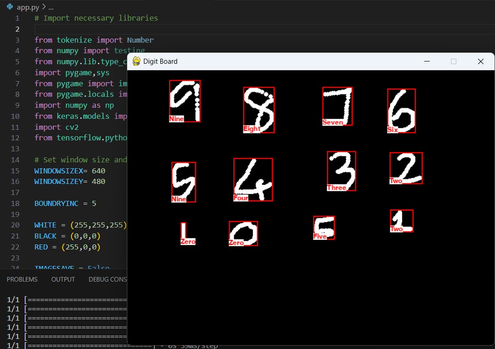

# Project Title: Handwritten Digit Recognition with Convolutional Neural Networks and Digit Drawing App

## Project Description

### Overview

Handwritten Digit Recognition with Convolutional Neural Networks and Digit Drawing App is a Python project that combines two main components:

1. **Digit Recognition Model**: This component focuses on developing a machine learning model capable of recognizing handwritten digits using Convolutional Neural Networks (CNNs).

2. **Digit Drawing App**: In addition to the digit recognition model, the project includes a Pygame-based application that allows users to draw digits on a canvas. The drawn digits can then be recognized by the trained model in real-time.

### Features

#### Digit Recognition Model

1. **MNIST Dataset**: The project uses the popular MNIST dataset, which consists of 28x28 pixel grayscale images of handwritten digits (0-9).

2. **Model Training**: A CNN model is trained on the MNIST dataset to learn and recognize patterns in the digit images.

3. **Model Evaluation**: The trained model is evaluated using a test dataset to assess its accuracy in correctly identifying handwritten digits.

4. **Model Saving and Loading**: The project demonstrates how to save the trained model to disk and load it for later use.

#### Digit Drawing App

1. **Pygame Interface**: The app provides a user-friendly interface created using Pygame, allowing users to draw digits using the mouse.

2. **Real-Time Recognition**: As users draw digits on the canvas, the trained model recognizes the drawn digit in real-time and displays the predicted digit label on the screen.

3. **Clear Canvas**: Users can clear the canvas and start drawing a new digit.

### Technologies Used

- **Python**: The primary programming language used for this project.
- **TensorFlow**: An open-source machine learning framework used for building and training neural networks.
- **Keras**: A high-level neural networks API that runs on top of TensorFlow, simplifying the model building process.
- **NumPy**: A Python library used for numerical computations, essential for data preprocessing.
- **Matplotlib**: A library for creating visualizations, used for displaying digit images and performance metrics.
- **Pygame**: A Python library for creating 2D games and graphical applications, used to develop the digit drawing app.

### Project Structure

The project is organized into the following components:

- `mnist_cnn.py`: The main script responsible for training the CNN model on the MNIST dataset.
- `evaluate_model.py`: A script to load the trained model and evaluate its accuracy on test data.
- `bestmodel1.h5`: A sample saved model checkpoint.
- `app.py`: A Pygame-based application that allows users to draw digits and receive real-time predictions.
- `README.md`: This project documentation.

### How to Use

1. **Clone the Repository**: Clone this GitHub repository to your local machine using the following command:

    ```bash
    git clone https://github.com/yourusername/handwritten-digit-recognition.git
    ```

2. **Install Dependencies**: Ensure you have the required Python packages installed. You can install them using `pip` as mentioned in the project's README.

3. **Train the Model**: Execute the `mnist_cnn.py` script to train the CNN model on the MNIST dataset. This script will save the trained model as `handrecogmodel.h5`.

4. **Run the Digit Drawing App**: Launch the Pygame-based digit drawing app by running the `app.py` script. This app allows you to draw digits and see real-time predictions from the trained model.

### Model Evaluation

After training the CNN model on the MNIST dataset, we evaluated its performance on the test dataset. Here are the evaluation metrics:

- **Accuracy**: The model achieved an accuracy of 99% on the test dataset, indicating the percentage of correctly classified digits.

You can also provide additional details about the model's performance, any challenges encountered during evaluation, or insights gained from the evaluation results.

### screenshot and demo video
Video link : [!Digit Recognition Demo](Demo video-thumbnail.png)(Demo video.mp4)

Screenshot : 


### Project Outcome

This project combines machine learning and interactive application development to create an educational and practical tool. Users can not only explore the process of building and training a deep learning model for handwritten digit recognition but also interact with the model in real-time through the digit drawing app.

By integrating the digit drawing app, this project becomes a valuable resource for both beginners and intermediate machine learning practitioners, as well as individuals interested in exploring the capabilities of Pygame for interactive applications.
